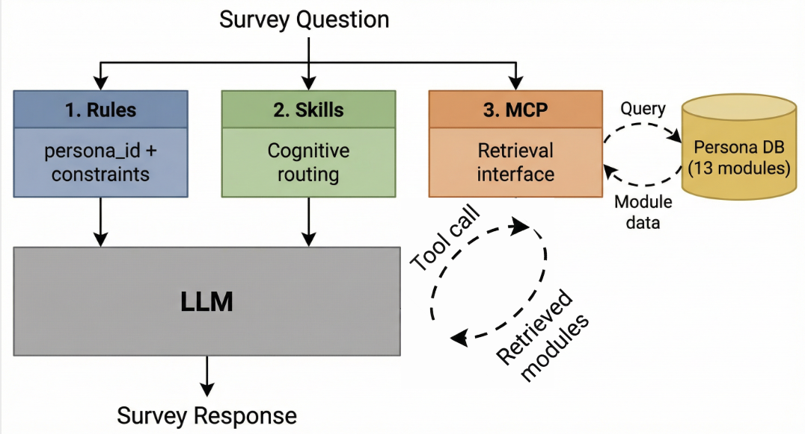

# Structured Silicon Sampling (S3)

Open-source implementation for the IC2S2 2026 paper:

> **Beyond Prompting: A Cognitively-Grounded Framework for Silicon Survey Samples**

S3 operationalizes the cognitive model of survey response (Tourangeau et al., 2000) as a Model Context Protocol (MCP) server. Instead of loading an entire persona backstory into the prompt, S3 stores persona information in a modular database and lets the LLM selectively retrieve only the modules relevant to each survey question.



## Architecture

The framework externalizes the four stages of the cognitive survey response model into three separable layers:

| Layer | Cognitive stage | What it does |
|-------|----------------|--------------|
| **Rules** | Comprehension + Response | Provides a minimal identity anchor (`persona_id`) and strict response constraints. No demographic or attitudinal content is pre-loaded, forcing the model to actively seek information. |
| **Skills** | Judgment + Strategy | A cognitive router that selects a reasoning procedure based on question type: *Factual Recall*, *Direct Attitude*, or *Attitude Construction*. Each skill specifies which modules to retrieve and how to synthesize them. |
| **MCP** | Retrieval | Exposes the persona as a modular database (13 domains, ~170 fields) accessible only via explicit tool calls. The model retrieves 2-5 modules per question rather than receiving all ~170 fields at once. |

## Repository Structure

```
server.py                 MCP server (core)
run_experiment.py         Experiment runner (Claude Agent SDK)
analyze_results.py        Compute per-persona metrics (exact match, within-1, MAE)
significance_analysis.py  Paired significance tests across phases
eval_items.json           22 held-out ANES 2024 evaluation items with ground truth

personas/                 50 ANES 2024 personas (stratified by party ID x region)
  anes_001.json ... anes_050.json

rules/                    Rule templates (researcher-specified)
  survey_respondent.txt   Full framework rule (identity anchor only)
  baseline_static.txt     Static backstory baseline (Argyle et al. style)
  rules_only.txt          Ablation: rules without Skills or MCP

skills/                   Skill templates (model-selected per question)
  factual_recall.txt      Personal circumstances and estimation
  direct_attitude.txt     Single-topic policy/social attitudes
  attitude_construction.txt  Complex cross-domain attitude formation

scripts/                  Data processing
  download_anes.py        Download ANES 2024 data
  generate_personas.py    Generate persona JSON files from ANES

results/                  Pilot experiment results (N=10 per phase)
  phase0_phase1_n10_seed2024.json   Phases 0-1
  phase2_n10_seed2024.json          Phase 2
  phase3_n10_seed2024.json          Phase 3
```

## Quick Start

### Prerequisites

- Python 3.10+
- An MCP-compatible client (Cursor, Claude Desktop, or Claude Agent SDK)

### Installation

```bash
pip install -r requirements.txt
```

### Run the MCP Server

```bash
# stdio transport (for Cursor, Claude Desktop)
python server.py

# SSE transport (for web clients)
python server.py --transport sse

# Restrict modules for phase experiments
python server.py --allowed-modules demographics life_narrative politics economy health social_context local_context
```

### Configure in Cursor

Add to `.cursor/mcp.json`:

```json
{
  "mcpServers": {
    "silicon-sampling": {
      "command": "python",
      "args": ["/absolute/path/to/server.py"]
    }
  }
}
```

### Configure in Claude Desktop

Add to `claude_desktop_config.json`:

```json
{
  "mcpServers": {
    "silicon-sampling": {
      "command": "python",
      "args": ["/absolute/path/to/server.py"]
    }
  }
}
```

## MCP Tools

| Tool | Description |
|------|-------------|
| `get_survey_skill` | Select a reasoning skill (`factual_recall`, `direct_attitude`, `attitude_construction`) based on question type |
| `get_persona_modules` | Selectively retrieve persona modules by name (e.g., `["economy", "demographics"]`) |
| `get_retrieval_log` | View all skill selections and module retrievals this session |

## Persona Modules

Each persona contains up to 13 thematic modules (~170 fields total):

| Module | Fields | Content |
|--------|--------|---------|
| `demographics` | 10 | Age, gender, race, education, income, marital status, religion, state |
| `life_narrative` | 1 | Summary of life circumstances |
| `politics` | 35 | Party ID, ideology, approval, voting, candidate evaluations, participation |
| `economy` | 18 | Employment, housing, investments, food security, economic outlook, trade |
| `health` | 20 | Insurance, healthcare concerns, mental health, diagnosed conditions |
| `social_context` | 19 | Social trust, group thermometers, immigration, police, guns |
| `racial_attitudes` | 16 | Racial/ethnic group thermometers, discrimination perceptions |
| `values_personality` | 9 | Moral foundations, authoritarianism, science attitudes |
| `media_consumption` | 12 | News sources, social media, Fox/CNN, institutional thermometers |
| `religion_community` | 7 | Attendance, importance, guidance, children, community |
| `local_context` | 2 | State, census region |
| `policy_positions` | 19 | Spending priorities, candidate placements, competence ratings |
| `civic_participation` | 3 | Campaign volunteering, signs, buttons |

## Experiment Design

The pilot experiment varies persona complexity across four phases to test the hypothesis that S3's advantage grows with information load:

| Phase | Modules | Fields | Retrieval |
|-------|---------|--------|-----------|
| 0: Sparse | 7 | ~31 | Limited (2-3 modules) |
| 1: Enriched | 11 | ~107 | Limited (2-3 modules) |
| 2: Enriched + free | 11 | ~107 | Unlimited |
| 3: Full | 13 | ~170 | Unlimited |

Each phase uses 10 randomly sampled personas (non-overlapping across phases) evaluated on 22 held-out ANES items across six domains (politics, economy, health, social context, racial attitudes, values).

### Reproducing Results

```bash
# Run experiment (requires Claude Agent SDK with Max subscription)
python run_experiment.py --phases 0 1 --n-personas 10 --conditions baseline_static full_framework --seed 2024
python run_experiment.py --phases 2 --n-personas 10 --conditions baseline_static full_framework --seed 2024
python run_experiment.py --phases 3 --n-personas 10 --conditions baseline_static full_framework --seed 2024

# Analyze results
python analyze_results.py results/phase0_phase1_n10_seed2024.json results/phase2_n10_seed2024.json results/phase3_n10_seed2024.json

# Significance tests
python significance_analysis.py
```

## Example Session

A typical survey simulation with the full framework:

```
1. Model reads Rule (survey_respondent.txt): receives persona_id and response constraints only
2. Model receives survey question: "How often can you trust the federal government?"
3. Model calls get_survey_skill("attitude_construction", "trust in federal government")
   -> Receives instructions to retrieve politics + economy + values_personality + demographics
4. Model calls get_persona_modules("anes_010", ["politics", "economy", "values_personality", "demographics"], "trust in federal government")
   -> Receives only those 4 modules (~80 fields), not all 170
5. Model synthesizes a response grounded in the retrieved information
```

## Ablation Conditions

The full evaluation plan compares four conditions to isolate each layer's contribution:

| Condition | Rule | Skills | MCP Retrieval |
|-----------|------|--------|---------------|
| Baseline | `baseline_static` (full backstory in prompt) | No | No |
| Rules only | `rules_only` (anchor + full backstory) | No | No |
| Rules + Skills | `survey_respondent` + skill selection + full backstory | Yes | No |
| Full S3 | `survey_respondent` + skill selection + selective retrieval | Yes | Yes |

## License

MIT
